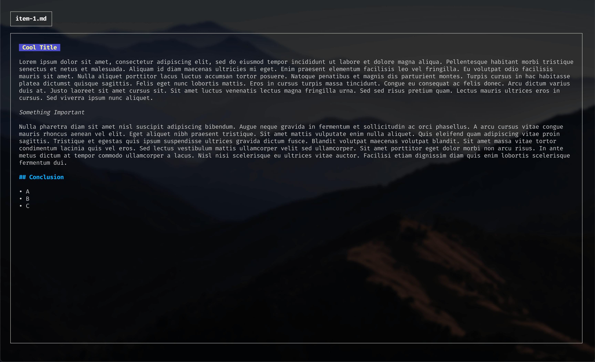

# notesm 📝

Notesm is a simple note taking app. You can create and view markdown notes with [glow like style](https://github.com/charmbracelet/glow). All you notes will be stored at `$home/.notesm/`.

 

## Run debug

`go run cmd/main.go`

## Build

`go build cmd/main.go`

